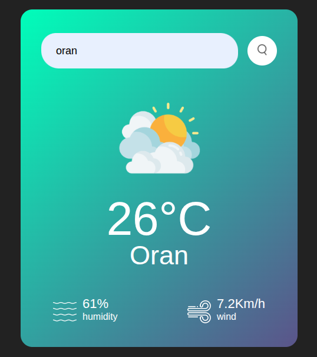

# 🌦️ Weather App

A simple and responsive weather application built using HTML, CSS, and JavaScript. It fetches real-time weather data from a public API and displays it with a clean and user-friendly interface.

## 🔍 Overview

This Weather App allows users to search for any city and view current weather conditions, including:
- Temperature
- Humidity
- Wind speed
- Weather icons

It uses the **OpenWeatherMap API** to retrieve live data and updates the interface dynamically based on user input.

## 🛠️ Technologies Used

- **HTML5** – Structure and layout
- **CSS3** – Styling and responsiveness
- **JavaScript (Vanilla)** – API requests and DOM manipulation
- **OpenWeatherMap API** – Real-time weather data

## 🎯 Features

- Real-time weather updates  
- Search by city name  
- Dynamic weather icons and status  
- Error handling for invalid inputs  
- Clean and responsive design

## 🔗 Live Preview

[👉 View Project Live](https://youssefbelhadadji.github.io/Weather_APPS/)

## 📸 Screenshot

